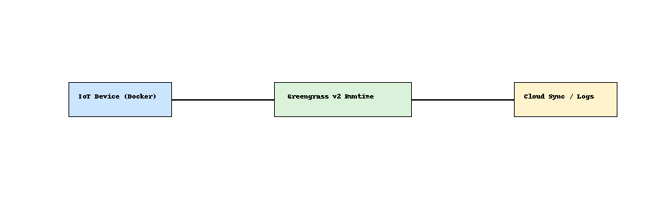

# Edge AI Inference Pipeline 🧠🌐

This project simulates a lightweight ML inference pipeline on edge devices using:

- AWS IoT Greengrass v2 (structure only)
- Dockerized Python app with a mock ML model
- SageMaker Neo (optional optimization placeholder)

## 🧠 Architecture



## 📁 Structure

- `greengrass-component/` – Mock Greengrass v2 structure
- `docker-app/` – Docker container with local inference logic
- `README.md` – Usage and architecture

## 🚀 Usage (Local Docker Test)

```bash
cd docker-app
docker build -t edge-ml .
docker run edge-ml "This is a great product"
```

## 🧪 Simulated Output

The mock model returns a fake sentiment score for demonstration.

